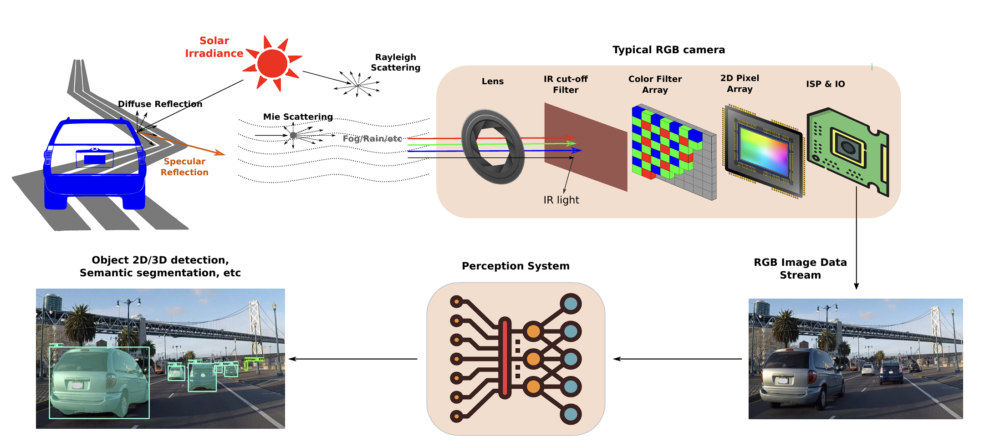
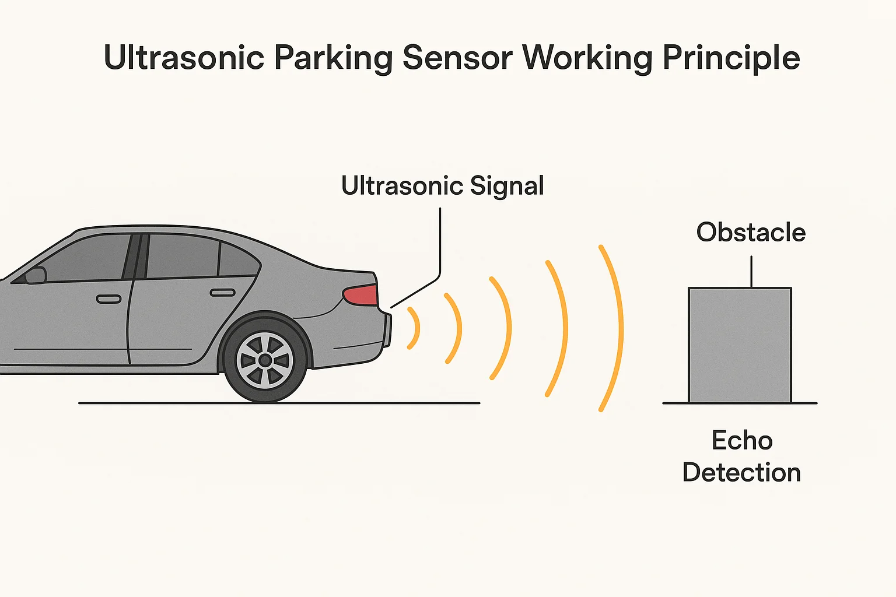
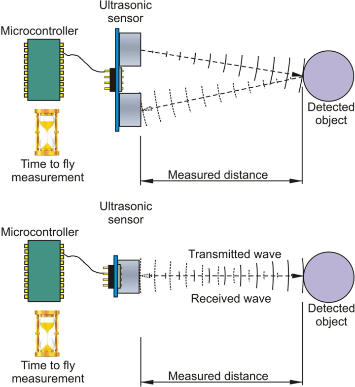
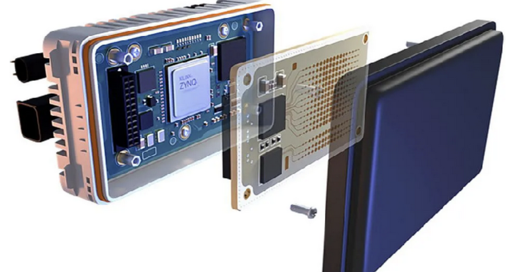
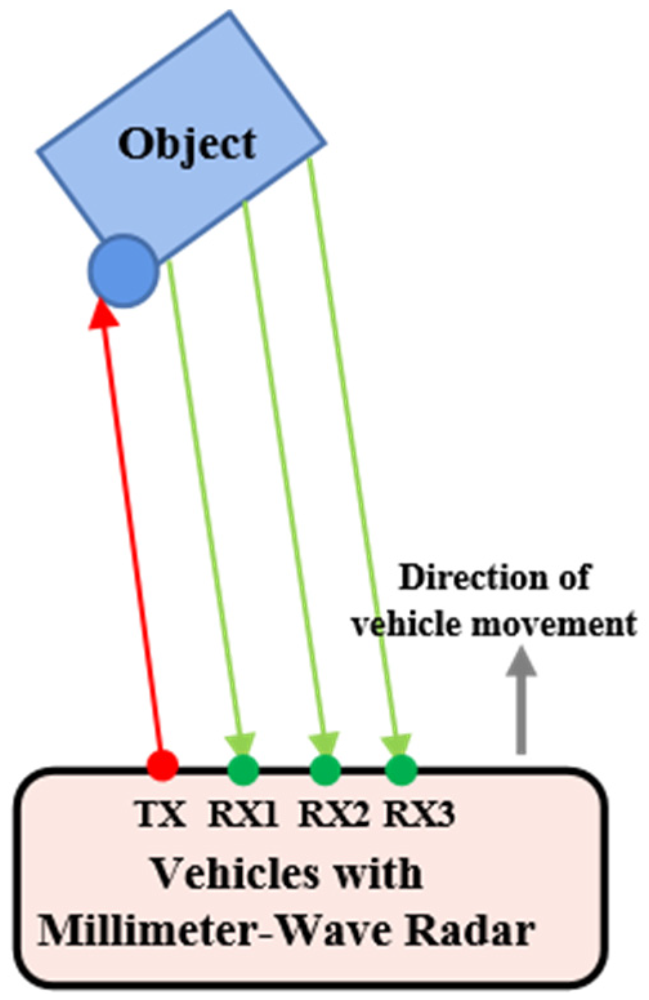
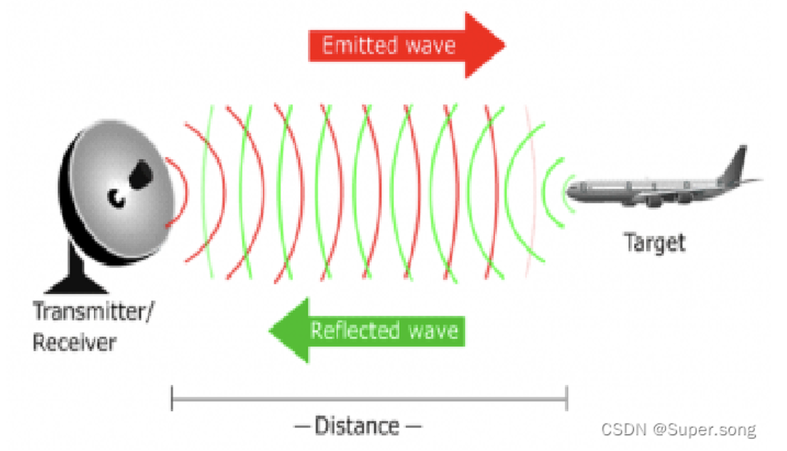

# team9_敬钰娟_week5_final.md

## 任务 1：FR_mid 车辆核心硬件与紧急制动

### 一、紧急制动相关操作

#### 1. 紧急制动按钮位置

FR_mid 车辆的紧急制动按钮通常位于驾驶舱中央控制台显眼位置（或方向盘左侧控制面板），采用红色醒目设计并带有 “紧急制动” 或 “STOP” 标识，便于驾驶员在突发情况下快速定位操作。

#### 2. 紧急制动与解除操作

紧急制动触发：当遇到碰撞风险、系统故障等紧急情况时，驾驶员需用力按下紧急制动按钮，车辆将立即切断动力输出并启动制动系统，使车辆快速平稳停下，同时相关安全警示灯亮起。

紧急制动解除：待车辆完全静止且危险情况排除后，需顺时针旋转紧急制动按钮（或按提示按压解锁），直至按钮弹回原位，此时紧急制动状态解除，车辆可恢复正常行驶。

### 二、核心传感器工作原理及作用

#### 1. LiDAR（激光雷达）

工作原理：激光雷达通过发射高频激光脉冲信号，激光脉冲遇到周围物体后反射，传感器接收反射信号并测量信号往返时间，结合激光发射角度和速度，计算出物体与车辆的距离、位置、轮廓等三维信息，进而生成周围环境的点云地图。

作用：作为自动驾驶车辆的核心感知传感器，激光雷达可精准识别车辆周围障碍物（如行人、车辆、护栏等）的位置和形状，为感知、决策规划层提供高精度环境数据，保障车辆在复杂路况下的行驶安全。

#### 2. GNSS/IMU（组合导航系统）

工作原理：GNSS（全球导航卫星系统）：通过接收多颗卫星的定位信号，结合时间同步技术，计算出车辆在地球坐标系中的绝对位置、速度和时间信息，但在隧道、高楼遮挡等场景下信号易受干扰，定位精度会下降。

IMU（惯性测量单元）：基于惯性原理，通过内部的加速度计和陀螺仪，实时测量车辆的加速度、角速度和姿态角，不受外部环境遮挡影响，但测量误差会随时间累积。

协同工作机制：GNSS 提供长期稳定的绝对定位信息，IMU 提供短期高精度的动态运动信息，两者通过数据融合算法互补，在复杂路况下（如城市峡谷、隧道切换）实现车辆定位的连续性和高精度，确保定位误差控制在厘米级。

作用：为自动驾驶车辆提供实时、精准的自身位置和运动状态数据，是定位层的核心组成部分，支撑路由规划、路径跟踪等关键功能的实现。

#### 3. 感知摄像头

工作原理：感知摄像头模拟人眼成像原理，通过镜头捕捉周围环境的光学图像，将光信号转换为电信号，经图像传感器（如 CMOS）处理后生成数字图像，再通过图像处理算法（如目标检测、图像分割）提取图像中的目标信息（如交通信号灯、车道线、交通标志、行人等）。

作用：作为视觉感知的核心部件，感知摄像头可识别交通规则相关信息（红绿灯状态、限速标志）、车道线位置及周围移动目标的运动轨迹，与激光雷达互补，丰富感知系统的环境数据维度，提升环境识别的全面性和准确性。
示意图：

#### 4. 超声波雷达

工作原理：超声波雷达通过发射高频超声波信号（通常为 40kHz 左右），超声波在传播过程中遇到障碍物后反射，传感器接收反射波并测量传播时间，根据超声波传播速度（约 340m/s）计算出障碍物与车辆的距离。

作用：主要用于近距离感知（探测距离通常为 0.1-5m），适用于低速场景（如倒车、泊车），可精准检测车辆前后方的近距离障碍物（如路沿、低矮障碍物），辅助完成泊车入位和低速避障，避免剐蹭事故。
示意图：

#### 5. 毫米波雷达

工作原理：毫米波雷达基于电磁波传播原理，发射波长为 1-10mm 的毫米波信号，信号遇到障碍物后反射，传感器接收反射信号，通过分析信号的频率偏移（多普勒效应）和传播时间，计算出障碍物的距离、速度和角度信息。

作用：具备较强的抗恶劣天气能力（不受雨、雾、灰尘影响），探测距离适中（通常为 10-200m），主要用于中远距离目标检测，可识别前方行驶车辆的速度、距离和相对位置，支持自适应巡航、紧急制动辅助等功能，保障车辆在高速行驶中的安全车距控制。
毫米波雷达构成示意图：

毫米波雷达工作原理示意图：

## 任务 2：Apollo 3.0 软件架构及其模块功能

| 模块名称 | 核心功能 | 代码路径 |
| --- | --- | --- |
| Perception（感知） | 负责接收激光雷达、摄像头、毫米波雷达等传感器数据，通过算法识别障碍物（行人、车辆、障碍物）、交通信号灯、车道线、交通标志等环境信息，生成结构化的环境感知结果 | modules/perception |
| Localization（定位） | 结合 GNSS/IMU 组合导航系统数据、地图数据及感知数据，通过定位算法计算车辆在世界坐标系和地图坐标系中的精确位置、姿态和速度，为决策规划提供位置支撑 | modules/localization |
| Map / HD Map（地图 / 高精地图） | 提供高精度道路地图数据，包含车道线位置、道路边界、交通标志位置、路口结构等详细信息，为定位、路由、规划模块提供地理参考依据，保障车辆行驶路径的准确性 | modules/map |
| Prediction（预测） | 基于感知模块输出的障碍物信息（位置、速度、姿态）和高精地图数据，预测障碍物未来一段时间内的运动轨迹（如行人行走方向、车辆行驶路径），为决策规划层提供预判数据，避免潜在碰撞 | modules/prediction |
| Routing（路由） | 根据用户输入的起点和终点，结合高精地图的道路拓扑结构、实时路况（若有），规划出一条最优行驶路线，明确车辆行驶的道路序列和转向节点，为规划模块提供全局路径指引 | modules/routing |
| Planning（规划） | 基于路由模块的全局路径、预测模块的障碍物轨迹及感知定位数据，规划车辆的局部行驶路径和运动状态（如加速、减速、转向、跟车距离），生成具体的行驶轨迹指令，确保车辆安全、平稳地跟随全局路线行驶 | modules/planning |
| Control（控制） | 接收规划模块输出的轨迹指令（如目标速度、目标转向角），通过控制算法（如 PID 控制）将指令转换为车辆的具体控制信号（如节气门开度、制动压力、转向助力大小），控制车辆的动力系统、制动系统和转向系统，实现精准的轨迹跟踪 | modules/control |
| Canbus（CAN 总线） | 作为车辆控制系统的通信接口，负责将 Control 模块输出的控制信号转换为 CAN 总线协议信号，传输至车辆底层执行机构（如发动机、制动系统、转向系统），同时将车辆底层的状态数据（如车速、发动机转速、制动状态）反馈给上层模块，实现上下层数据交互 | modules/canbus |
| HMI（Human Machine Interface，人机交互界面） | 提供驾驶员与自动驾驶系统的交互入口，展示车辆行驶状态（如速度、定位、自动驾驶模式）、系统故障提示、路线信息等，同时支持驾驶员手动切换驾驶模式、输入目的地等操作，实现人机协同 | modules/hmi |
| Monitor（监控） | 实时监控自动驾驶系统各模块（感知、定位、决策规划等）的运行状态，检测模块数据传输异常、算法执行故障、传感器故障等问题，及时发出故障警报并记录故障信息，为系统维护和故障排查提供支持 | modules/monitor |
| Guardian（安全守护） | 作为自动驾驶系统的安全冗余模块，持续监控车辆行驶状态和周围环境，当检测到系统故障、潜在碰撞风险或超出自动驾驶能力范围的场景时，自动触发安全措施（如紧急制动、提醒驾驶员接管），保障行车安全 | modules/guardian |
